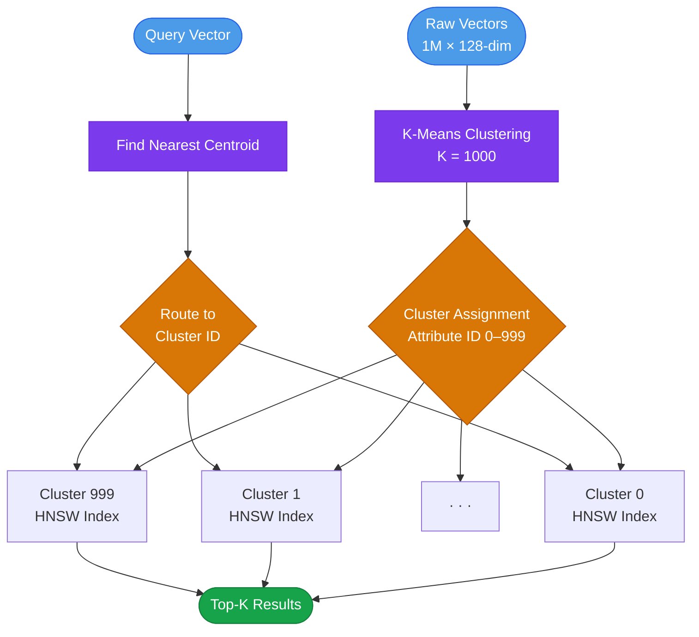
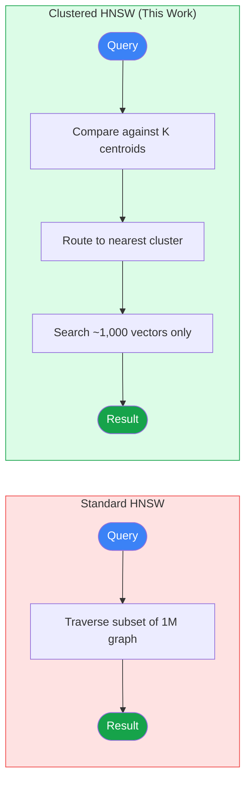
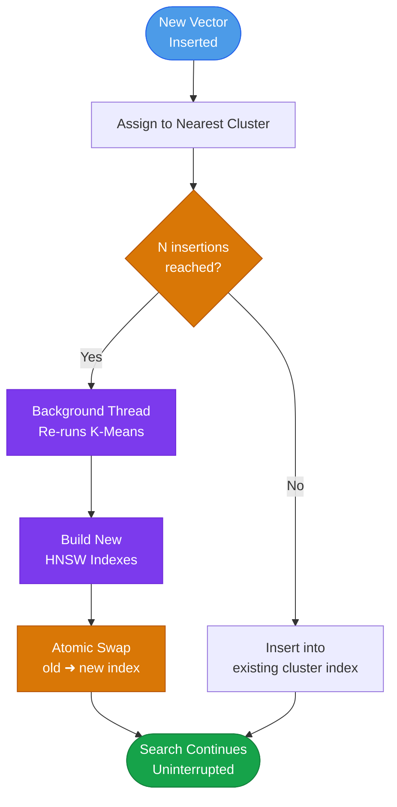
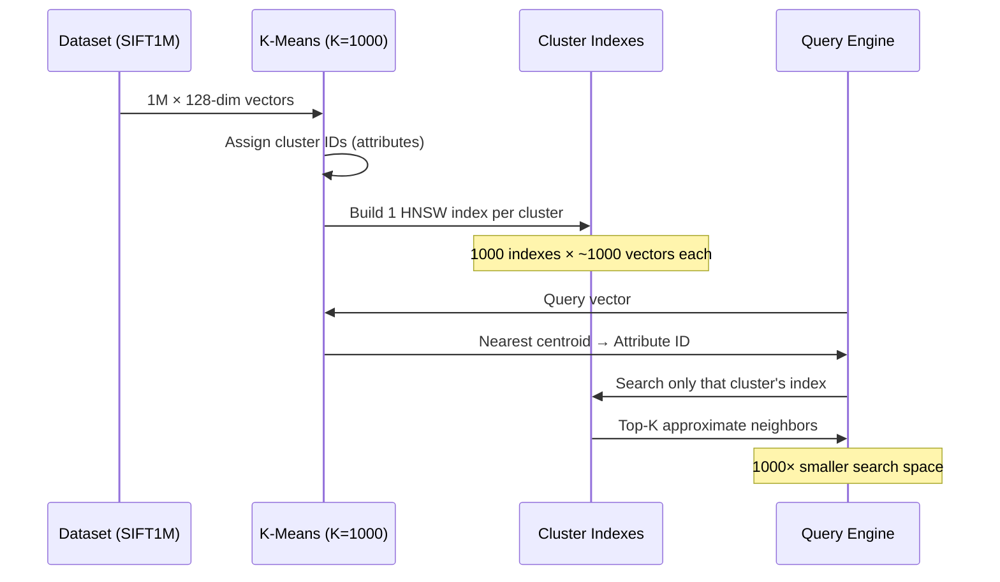

# Real-Time Hybrid Clustered Vector Search

## Clustered Attributed Vector Search
We partition the base dataset into K spatial clusters [16] using MiniBatchKMeans. Each partion will store one centroid per cluster. At query time, the query vector is compared against all centroids to identify the nearest clusters. This is the routing step, inspired by IVF in FAISS [2]. Rather than scanning the full 1M vectors, only the vectors within the top K clusters are searched. Within each cluster, we build an independent HNSW index [1], a hierarchical graph where each vector is connected to its nearest neighbors across multiple layers. Search traverses this graph greedily, moving layer by layer toward the query vector. This replaces the flat exhaustive scan used in standard IVF, giving higher recall at the same cluster probe budget.

---

## Background

The interactive visualization below provides a high-level overview of the complete vector search architecture. It illustrates how a query flows through the system, including query processing, cluster selection, similarity search, graph traversal, candidate refinement, reranking, and final result retrieval. The goal is to help readers understand how the different components interact to deliver efficient and scalable nearest-neighbor search.

▶ Explore the System Pipeline: https://salemmohammed.github.io/my-vector-search

---

## Research Questions

| # | Question | Theme |
|---|---|---|
| RQ1 | Can representing each partition of a million-scale vector dataset by a centroid vector, and routing queries to the nearest partition, improve query throughput while preserving recall@1 ≥ 0.95 (At least 95% of queries return the true nearest neighbor as the first result) compared to searching the full unpartitioned dataset? | **Efficiency** |
| RQ2 | When a vector dataset has complete attributes, partial attributes, no attributes, imbalanced clusters, or spatially overlapping clusters, which partitioning strategy preserves the best recall@1 and QPS, and what are the tradeoffs? | **Partitioning Strategy Under Varying Attribute Conditions** |
| RQ3 | As new vectors are continuously inserted into a live index, how does recall and QPS degrade over time without re-clustering, and what is the degradation rate relative to insertion volume? | **Real-Time Degradation** |
| RQ4 | Can background re-clustering with atomic index swapping fully restore recall and QPS to pre-insertion levels with zero query interruption, and what is the measurable cost of re-clustering itself? | **Real-Time Recovery** |
| RQ5 | Does the clustered approach scale sub-linearly with dataset growth compared to standard HNSW, and at what dataset size does clustering yield the greatest benefit? | **Scalability** |
| RQ6 | Does attribute based clustering make vector search more understandable than monolithic HNSW by enabling three capabilities that standard HNSW cannot provide: (1) tracing exactly which cluster a query was routed to, (2) identifying which individual cluster is causing recall degradation, and (3) predicting worst-case query latency from cluster size alone without running the full system? | **Understandability** |
---

## Partitioning Strategies

Partitioning reduces the search space by dividing a large vector dataset into smaller subsets. Instead of searching the entire dataset, the system first identifies the most relevant partition(s) and then performs similarity search within those partitions. Different partitioning strategies provide different tradeoffs between search accuracy (Recall@1) and query throughput (QPS).

### Attribute-Based Partitioning

Vectors are grouped according to metadata attributes such as category, location, document type, or tenant identifier. This strategy can significantly reduce the search space when complete and reliable attributes are available. However, its effectiveness decreases when attributes are missing, incomplete, or noisy [14].

### Spatial Partitioning

Vectors are grouped according to their positions in the embedding space using clustering algorithms such as K-Means or MiniBatchKMeans. Queries are first routed to the nearest cluster centroids, and similarity search is then performed within the selected clusters. This approach forms the foundation of Inverted File (IVF) indexing and is widely used in large-scale vector search systems [15,3].

### Hybrid Partitioning

Hybrid partitioning combines metadata-based filtering with spatial clustering. The dataset is first partitioned using attributes and then clustered according to vector similarity within each partition. This strategy leverages both semantic filtering and vector locality to improve search efficiency while maintaining high recall [14].

### Random Partitioning

Vectors are assigned randomly to partitions. Although this approach provides balanced partition sizes and serves as a useful experimental baseline, it does not preserve vector locality and generally leads to lower search efficiency and recall compared to similarity-aware partitioning methods.

### No Partitioning

All vectors are stored in a single index, and every query searches the entire dataset. While this approach avoids partition-induced recall loss, it becomes increasingly expensive as dataset size grows.

---

## Core Idea

Standard HNSW traverses a subset of the full graph on every query, but that graph still contains all 1,000,000 vectors, causing the search space to grow as the dataset scales. This project partitions vectors into attribute-based clusters, allowing each query to be routed to a single small cluster before HNSW search is performed. As a result, the search space remains bounded and largely independent of the total dataset size.

A key advantage of this design is support for real-time updates. New vectors can be inserted directly into their corresponding clusters without rebuilding a global index, enabling the system to maintain low-latency search performance while continuously ingesting new data.

```
Standard HNSW:
  Query --> traverses a small subset of the 1M graph
        --> controlled by ef_search parameter
        --> visits O(ef × log N) nodes approximately
        --> search space grows with dataset size N

Clustered HNSW (this project):

  Offline (build time):
    1,000,000 vectors  --> partitioned into K clusters
    Each cluster       --> represented by 1 centroid vector
    Each cluster       --> gets its own small HNSW index (~1,000 vectors)

  Online (query time):
    Query --> compared against K centroids only
          --> routed to nearest cluster
          --> HNSW runs on that cluster only (~1,000 vectors)
          --> search space bounded by cluster size
          --> independent of total dataset size N
```

---

## System Architecture



---

## Standard HNSW vs Clustered HNSW


---

## Real-Time Insertion & Re-Clustering



---

## Algorithm Pipeline



---

## What Is a Vector / Embedding?

An embedding converts complex data (images, text) into numbers so that similar things have similar numbers.

```
Cat photo    → [0.2, 0.8, 0.1, 0.9, ...]   ← similar!
Another cat  → [0.2, 0.7, 0.1, 0.8, ...]   ← similar!
Dog photo    → [0.9, 0.1, 0.7, 0.2, ...]   ← different
```

This project uses **SIFT descriptors** — 128-dimensional vectors describing visual patches of images.

---

## Dataset: SIFT1M

| Property | Value |
|---|---|
| Base vectors | 1,000,000 |
| Query vectors | 10,000 |
| Dimensions | 128 |
| Data type | float32 |
| Distance metric | L2 (Euclidean) |
| Size | ~500 MB |

```bash
cd experiments
mkdir sift && cd sift
wget ftp://ftp.irisa.fr/local/texmex/corpus/sift.tar.gz
tar -xzf sift.tar.gz
mv sift/* . && rm -rf sift sift.tar.gz
```

---

## Key Concepts

| Concept | Definition |
|---|---|
| Recall@1 | % of queries where true nearest neighbor was found |
| QPS | Query throughput, measured as the average number of queries processed per second |
| K (results) | Number of nearest neighbors to return |
| ef | Search exploration factor; controls the size of the candidate list maintained during graph traversal. Larger values typically improve recall at the cost of higher query latency. |
| M | Graph connectivity; neighbors per node |
| Cluster | A partition of vectors sharing similar spatial properties |
| Attribute | The cluster ID assigned to each vector |

---

## Libraries

| Library | Role | Source |
|---|---|---|
| hnswlib | Core HNSW algorithm (header-only C++) | [nmslib/hnswlib](https://github.com/nmslib/hnswlib) |
| FAISS | Alternative index (IVF, PQ, HNSW + GPU) | [facebookresearch/faiss](https://github.com/facebookresearch/faiss) |

Both are included as Git submodules pointing to author forks.

---

## Repository Structure

```text
my-vector-search/
├── benchmarks/                    # Benchmark algorithms, datasets, and results
│   ├── algorithms/                # Brute-force and FAISS IVF baselines
│   ├── data/                      # Dataset download scripts and ANN benchmark data
│   ├── figures.html               # Benchmark visualization page
│   ├── README.md                  # Benchmark documentation
│   └── results.csv                # Benchmark results
│
├── docs/                          # GitHub Pages documentation
│   ├── index.html                 # Interactive system pipeline visualization
│   └── figures.html               # Project figures
│
├── experiments/                   # Main experimental evaluation
│   ├── approach2_attribute/       # Attribute-clustered HNSW approach
│   │   ├── build_indexes.cpp      # Builds one HNSW index per cluster
│   │   ├── dynamic_reindex.cpp    # Real-time insertion and background re-clustering
│   │   ├── generate_attributes.py # Generates cluster attributes
│   │   ├── search.cpp             # Cluster-routed ANN search
│   │   ├── benchmark.sh           # Benchmark script
│   │   ├── run_all.sh             # Full experiment pipeline
│   │   ├── README.md              # Approach documentation
│   │   └── RESULTS.md             # Approach results summary
│   │
│   ├── baseline/                  # Standard HNSW baseline
│   │   ├── sift1m_search.cpp      # Baseline search implementation
│   │   └── sift -> ../sift        # Symlink to SIFT dataset
│   │
│   ├── dashboard.html             # Experiment dashboard
│   └── README.md                  # Experiment documentation
│
├── hnswlib/                       # HNSW library fork/submodule
├── index.html                     # Root interactive landing page
├── figures.html                   # Root visualization page
├── results.csv                    # Main result summary
└── README.md
```

---

## Approach: Attribute-Based Clustering (K=1000)

```
Step 1: Run K-Means (K=1000) on 1M SIFT vectors
        Each cluster = one attribute
        Attribute value = cluster ID (0 to 999)

Step 2: Build one HNSW index per cluster
        1000 indexes × ~1000 vectors each

Step 3: At query time:
        find nearest centroid → attribute ID
        search only that cluster's index
        return top K results

Step 4 (real-time):
        background thread re-clusters every N insertions
        atomic swap — search never stops
```

---

## Baseline Experiment Setup

| Metric | Value |
|---|---|
| Dataset | SIFT1M (1M × 128) |
| Build time | TBD |
| Recall@1 | TBD |
| Search time | TBD |
| QPS | TBD |
| M | 16 |
| ef_construction | 200 |
| ef_search | 50 |
| K results | 10 |

---

## Evaluation

| Metric | Description |
|---|---|
| Build Time | Index construction time |
| Recall@1 | Top-1 nearest-neighbor accuracy |
| QPS | Queries processed per second |
| Search Space | Vectors searched per query |
| Update Cost | Insert and maintenance cost |
| Scalability | Performance as dataset size increases |

## Quick Start

### 1. Clone the Repository

```bash
git clone https://github.com/salemmohammed/my-vector-search.git
cd my-vector-search
```

### 2. Install Dependencies

**macOS**

```bash
brew install cmake
pip3 install numpy scikit-learn
```

**Ubuntu**

```bash
sudo apt update
sudo apt install -y build-essential cmake python3 python3-pip wget
pip3 install numpy scikit-learn
```

### 3. Download the SIFT1M Dataset

```bash
cd experiments
mkdir -p sift
cd sift

wget ftp://ftp.irisa.fr/local/texmex/corpus/sift.tar.gz
tar -xzf sift.tar.gz

mv sift/* .
rm -rf sift sift.tar.gz

cd ../..
```

### 4. Run Experiments

See `experiments/README.md` for detailed instructions on running the baseline HNSW and clustered HNSW evaluations.

---

## Related Work

This project is positioned within a growing body of research on **filtered and partitioned approximate nearest neighbor (ANN) search**:

- **HNSW** — Malkov & Yashunin (2018) introduced the hierarchical navigable small world graph, which achieves near-logarithmic search behavior with strong recall at millisecond latencies. HNSW consistently ranks at the Pareto-optimal front on standard ANN benchmarks such as ANN-Benchmarks [[1]](#references).

- **FAISS** — Johnson et al. (2017) introduced FAISS, which provides efficient IVF (inverted file) indexing by clustering vectors with K-Means and searching only the nearest cluster centroids at query time [[2]](#references). This is the foundational technique our approach extends.

- **IVF Cluster Routing** — Traditional IVF methods partition vectors into clusters based on distance to centroids, then at query time identify the most promising clusters and perform exact search only within those posting lists [[3]](#references). Our approach applies this partitioning idea at a finer granularity, with per-cluster HNSW indexes instead of flat lists.

- **ACORN** — Patel et al. (2024) proposed ACORN for predicate-agnostic filtered vector search, leveraging HNSW with denser vertex neighborhoods to maintain graph connectivity under attribute filters [[4]](#references).

- **Compass** — Ye et al. (2025) introduced Compass, combining IVF-based cluster routing with a proximity graph, demonstrating that hybrid partition + graph indexing achieves competitive QPS and recall across selectivity levels [[5]](#references).

- **Curator** — Engels et al. (2026) showed that partition-based approaches like per-label HNSW indexes can eliminate query-time filtering overhead but require careful tradeoffs between memory and search performance [[6]](#references).

- **Filtered ANNS Survey** — Recent work on filtered approximate nearest neighbor search demonstrates that HNSW's performance degrades in low-selectivity scenarios, where partition-based methods may be preferable, and that hybrid indexing can be necessary for optimal performance across the full selectivity spectrum [[7]](#references).

- **Insertion Order Effects** — Elliott & Clark (2024) showed that HNSW recall is significantly influenced by data insertion sequence and intrinsic dimensionality, with insertion order informed by known categories shifting recall by up to 12 percentage points [[8]](#references). This directly motivates our cluster-aware insertion strategy.

- **ANN-Benchmarks** — Aumüller et al. (2018) established the standard benchmark for evaluating ANN indexes on datasets including SIFT1M, measuring recall@k, QPS, build time, and memory footprint [[9]](#references).

- **Clustered Hybrid Search (Aslam et al.)** — A directly related project on clustered hybrid search that this work builds upon [[10]](#references).

---

## References

<a name="references"></a>

[1] Y. A. Malkov and D. A. Yashunin, "Efficient and Robust Approximate Nearest Neighbor Search Using Hierarchical Navigable Small World Graphs," *IEEE Transactions on Pattern Analysis and Machine Intelligence*, vol. 42, no. 4, pp. 824–836, 2020. [arXiv:1603.09320](https://arxiv.org/abs/1603.09320)

[2] J. Johnson, M. Douze, and H. Jégou, "Billion-Scale Similarity Search with GPUs," *IEEE Transactions on Big Data*, vol. 7, no. 3, pp. 535–547, 2021. [arXiv:1702.08734](https://arxiv.org/abs/1702.08734)

[3] H. Jégou, M. Douze, and C. Schmid, "Product Quantization for Nearest Neighbor Search," *IEEE Transactions on Pattern Analysis and Machine Intelligence*, vol. 33, no. 1, pp. 117–128, 2011. *(SIFT1M dataset also introduced here.)* [Link](http://corpus-texmex.irisa.fr/)

[4] L. Patel, P. Kraft, C. Guestrin, and M. Zaharia, "ACORN: Performant and Predicate-Agnostic Search Over Vector Embeddings and Structured Data," *Proc. ACM Management of Data*, 2024. [arXiv:2403.04871](https://arxiv.org/abs/2403.04871)

[5] C. Ye et al., "Compass: General Filtered Search across Vector and Structured Data," *arXiv preprint*, 2025. [arXiv:2510.27141](https://arxiv.org/abs/2510.27141)

[6] J. Engels, B. Landrum et al., "Curator: Efficient Vector Search with Low-Selectivity Filters," *arXiv preprint*, 2026. [arXiv:2601.01291](https://arxiv.org/abs/2601.01291)

[7] (Anonymous), "Filtered Approximate Nearest Neighbor Search in Vector Databases," *arXiv preprint*, 2026. [arXiv:2602.11443](https://arxiv.org/abs/2602.11443)

[8] O. P. Elliott and J. Clark, "The Impacts of Data, Ordering, and Intrinsic Dimensionality on Recall in Hierarchical Navigable Small Worlds," *arXiv preprint*, 2024. [arXiv:2405.17813](https://arxiv.org/abs/2405.17813)

[9] M. Aumüller, E. Bernhardsson, and A. Faithfull, "ANN-Benchmarks: A Benchmarking Tool for Approximate Nearest Neighbor Algorithms," *Information Systems*, vol. 87, 2020. [ann-benchmarks.com](https://ann-benchmarks.com/)

[10] A. Aslam et al., "Clustered Hybrid Search," GitHub Repository. [Link](https://github.com/AdeelAslamUnimore/Clustered_Hybrid_Search)

[11] M. Ester, H.-P. Kriegel, J. Sander, and X. Xu, "A Density-Based Algorithm for Discovering Clusters in Large Spatial Databases with Noise," KDD, 1996.

[12] J. Mohoney et al., "High-Throughput Vector Similarity Search in Knowledge Graphs," *SIGMOD*, 2023.  

[13] J. Zhu et al., "An Experimental Evaluation of Hybrid Querying on Vectors," *PVLDB*, 2025.

[14] Y. Jin et al., "Curator: Efficient Indexing for Multi-Tenant Vector Databases," *arXiv preprint arXiv:2401.07119*, 2024.

[15] J. Sivic and A. Zisserman, "Video Google: A Text Retrieval Approach to Object Matching in Videos," *Proceedings of the IEEE International Conference on Computer Vision (ICCV)*, 2003.

[16] D. Sculley, "Web-Scale K-Means Clustering," in *Proceedings of the 19th International Conference on World Wide Web (WWW)*, Raleigh, NC, USA, 2010, pp. 1177–1178, doi: 10.1145/1772690.1772862.
---

## Authors

Salem Alqahtani, Adeel Aslam, Khaled Mahmoud, Badr Asiri, Osama Al-Senani,
Faisal Azib, Abdullatif Hadi, Faisal Awad, and Omar Abdulaziz

